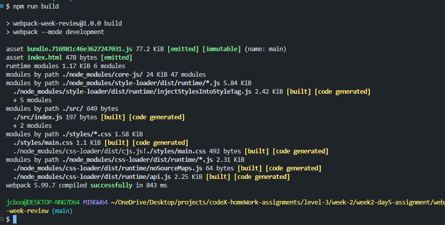
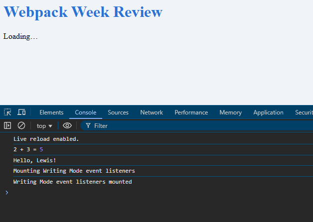
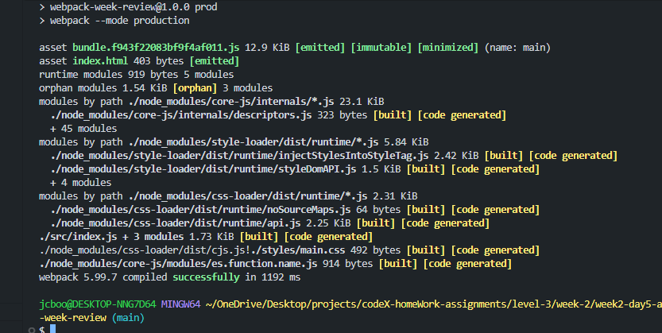
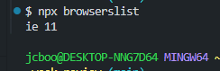

## Packages Installed

- webpack
- webpack-cli
- html-webpack-plugin
- style-loader
- css-loader
- @babel/core
- @babel/preset-env
- babel-loader
- core-js

## Key Config Lines

entry: "./src/index.js",
output: {
filename: "bundle.[contenthash].js",
path: path.resolve(process.cwd(), "dist"),
clean: true,
},
module: {
rules: [
{
test: /\.js$/i,
      exclude: /node_modules/,
      use: { loader: "babel-loader" },
    },
    {
      test: /\.css$/i,
use: ["style-loader", "css-loader"],
},
],
},
plugins: [
new HtmlWebpackPlugin({
template: "./index.html",
}),
],

- I had to add this code to package.json because without it i was still getting a massive list of browsers.
  "browserslist": [
  "ie 11"
  ]

